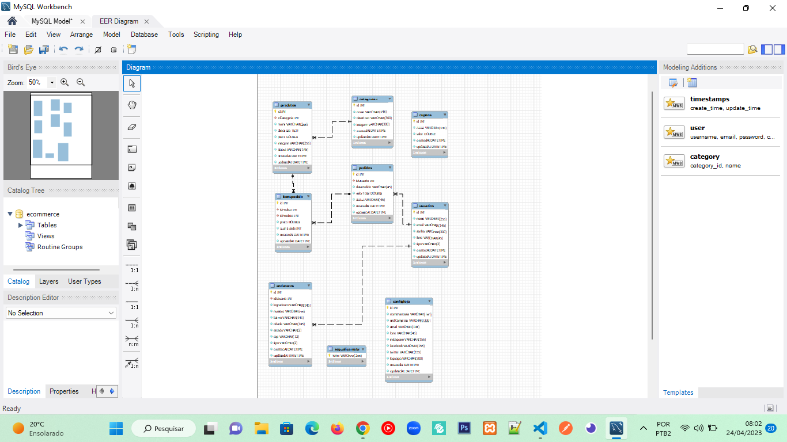

# Desafio Final Gama XP47 - Ecommerce [ back-end ]
## ***Repositório referente ao desafio final da Gama xp 47 - Back-end ecommerce***

## ***Tecnologias Utilizadas***

- node.js
- Typescript
- MySQL

## ***Padrões de Projeto***

- Solid/DDD

## ***Detalhes do projeto***

Este projeto foi construído com as técnicas avançadas de node/express.
Foi aplicado o padrão dot/env onde é criado um arquivo .env que contém constantes de ambiente
cujo os quais guardam os valores sensiveis, tais como: dados de acesso de banco de dados, e chaves secretas(SECRET_KEY).
Além do arquivo .env é creiado também um arquivo .env.exampple, que é criado apenas com a chave sem o valor. Assim ao
subir um commit para o github apenas esse arquivo(.env.example) sob junto com o restante dos outros arquivos do projeto.
Evitando assim, que o arquivo contendo os dados sensíveis suba para o repositório do github.

Foi aplicado também o padrão de encriptação de senhas com a dependência 'bcryptjs', ao inserir um usuário no banco de dados.
E também o padrão jwt(jasonwebtoken), que quando o usuário loga na api, é retornado um token de autenticação para poder verificar
a autenticidade do usuário em páginas onde requer autenticação.

## ***Diagrama do banco de dados***

## ***Link da documentação da api***

https://crdigital.github.io/desafio_final_gama_xp47_ecommerce_back-end/

## ***Link do repositório do front-end***
